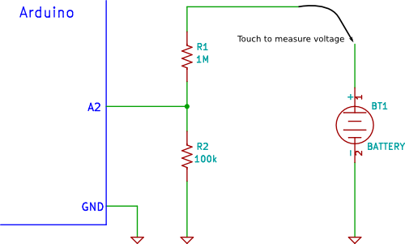

# low battery warning

## Goal

I want to know when the battery should be recharged. I want to avoid starting a bike tour and the coputer goes of after a couple of minutes.
Ideally I could see some sort of battery level in steps, but a warning on a certain threshold (~30-50%) would be also better than nothing.

## Infos

- Can use Attiny45 analog pin to read voltage, thanks to the i2c communication

### Voltage Divider

R1: 100kOhm
R2: 150kOhm
=> 19.5uA constant current

ToDo:

- [ ] Calibration-Script - get min & max voltage readout of LiPo
- [ ] convert Battery Voltage to 2-Bit State
  - [ ] 0 - > 0%
  - [ ] 1 - >25%
  - [ ] 2 - >50%
  - [ ] 3 - >75%

## Usefull Links / Tutorials / Resources

ESP-03 does not have an analog-read pin -> no direct level measurment
https://www.electroschematics.com/low-battery-indicator/
[1S LiPo Low Voltage indicator](https://www.flitetest.com/articles/diy-micro-1s-low-voltage-warning)
