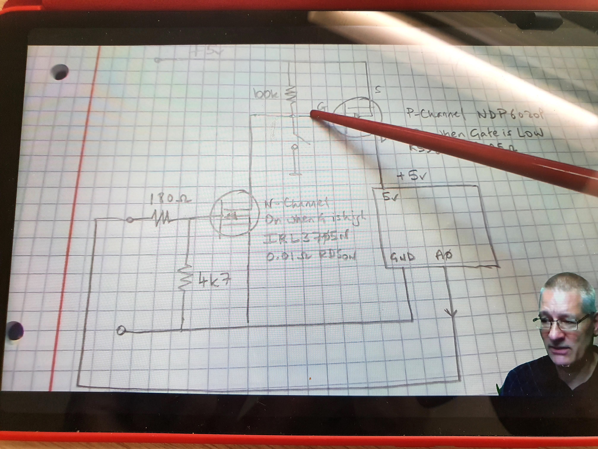
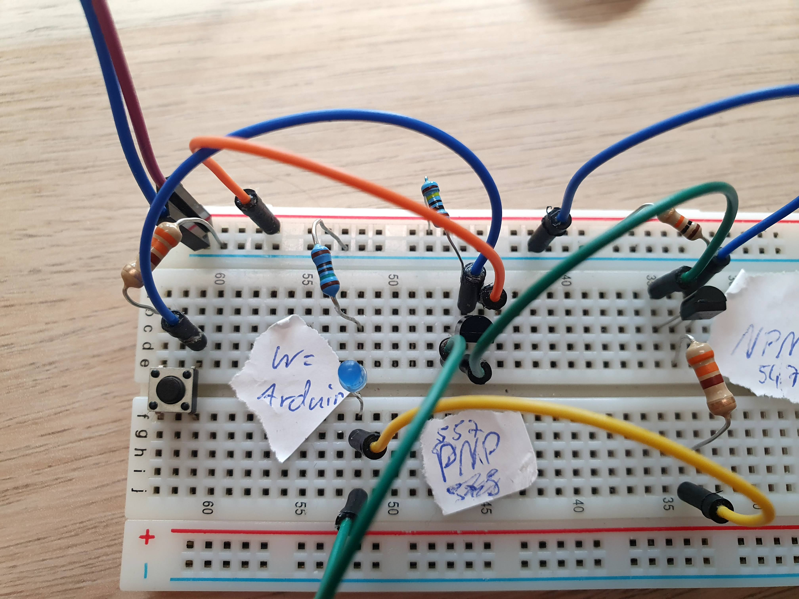
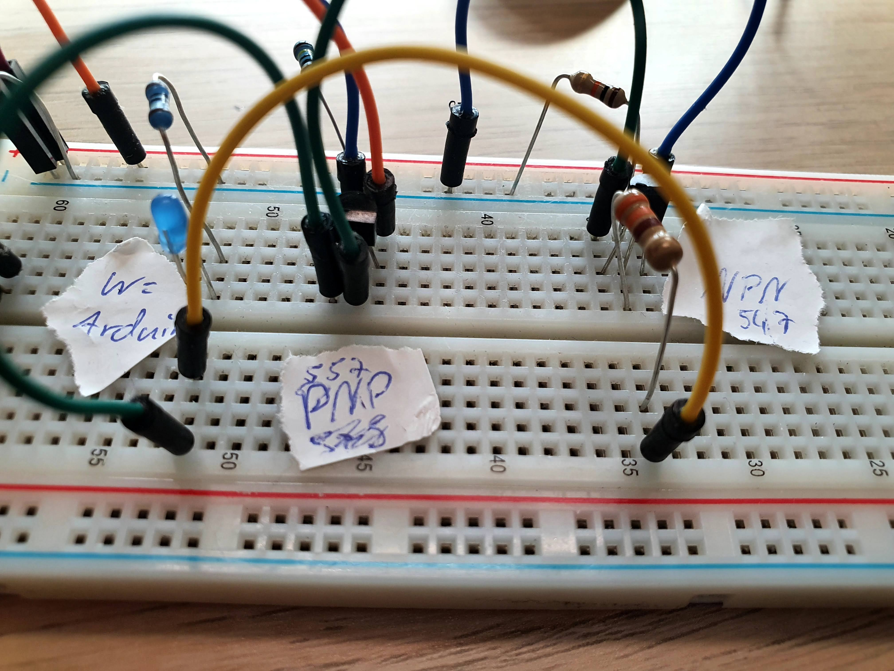
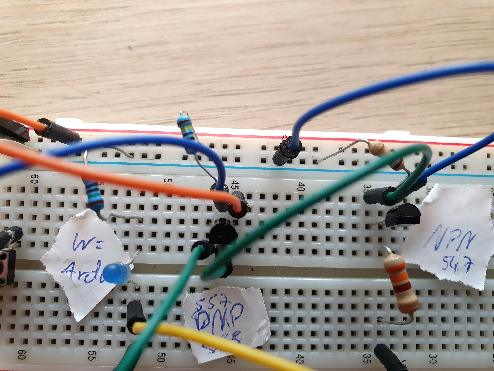
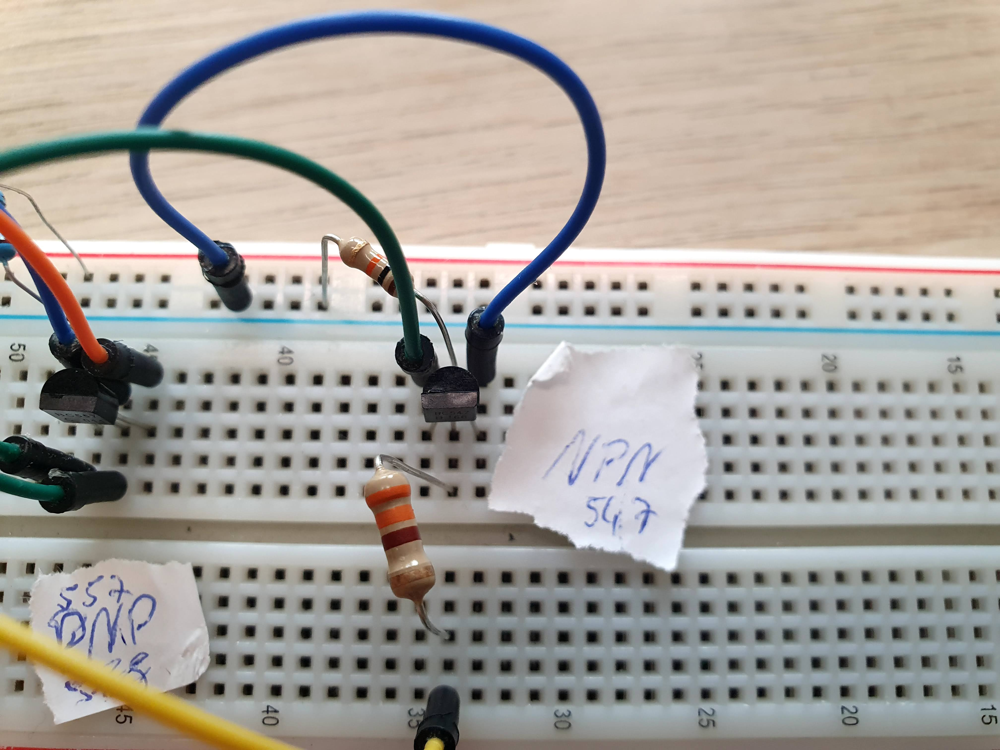

# Self Power-Off Circuit

## Goal

The goal of this sub-project is, to allow the microcontroller to fully turn off the circuit to reduce the idle power consumption as much as possible. This should allow the microcontroller to decide when all work is done and the OLED, microcontroller and whatever else is connected does not need any power.

## Specifications

- allow microcontroller to completely cut battery connection
- wakeup with a single button push - idealy no extra button should be added

## Resources

- https://youtu.be/g1rbIG2BO0U
- https://randomnerdtutorials.com/latching-power-switch-circuit-auto-power-off-circuit-esp32-esp8266-arduino/
- https://circuitjournal.com/arduino-auto-power-off
- https://www.instructables.com/Arduino-Microcontroller-Self-Power-Off/
- https://e2e.ti.com/blogs_/b/powerhouse/posts/maximize-shelf-life-with-a-one-time-push-button-switch

## Solution

I decided to use the Implementation from https://youtu.be/g1rbIG2BO0U because it provided the most detailed instructions and measurment examples.

[📼 Demo Video 📼](./demo.mp4)

Unfortunately I only had NPN & PNP Transistors on hand which isn't ideal for the power consumption in the on state (AFAIK), in the final design N-Channel & P-Channel MOSFETs should be used, just like in the source I copied this circuit from.

