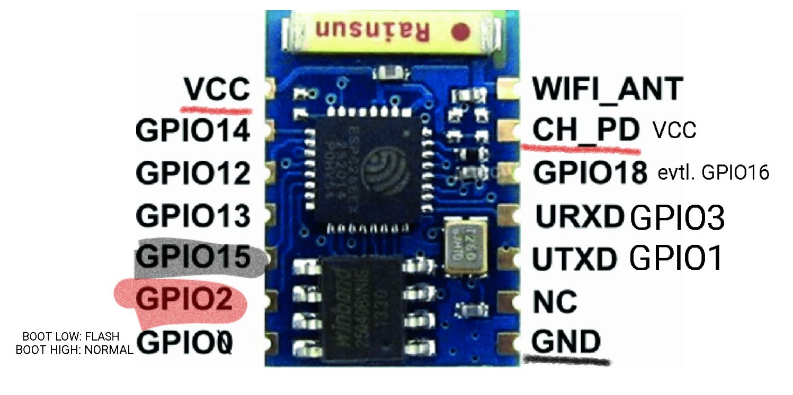
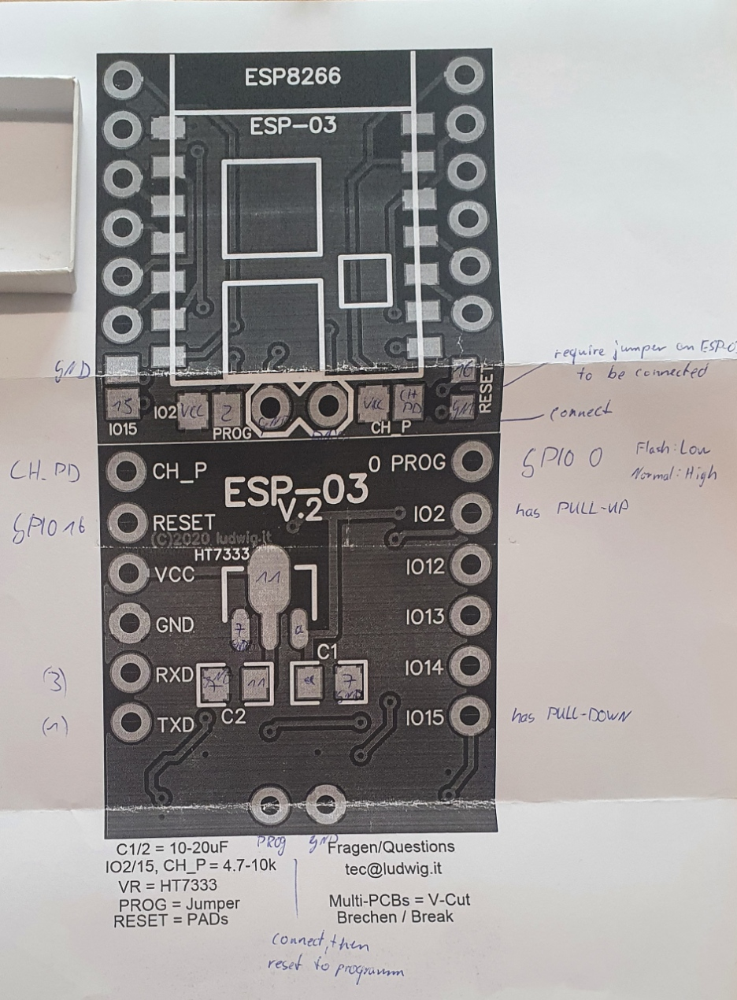

# ESP8266-03

- red underline - connect to VCC
- black underline - connect to GND
- red background - needs PULL-UP resistor (HIGH at boot)
- black background - needs PULL-DOWN resistor (LOW at boot)
- GPIO16 = GPIO18 (= RESET, when Jumper near VCC/Antenna is connected)

## DEV-Breakout Board Pins

Two Bottom PINS => Shorten then reset to program (PROG & GND)
